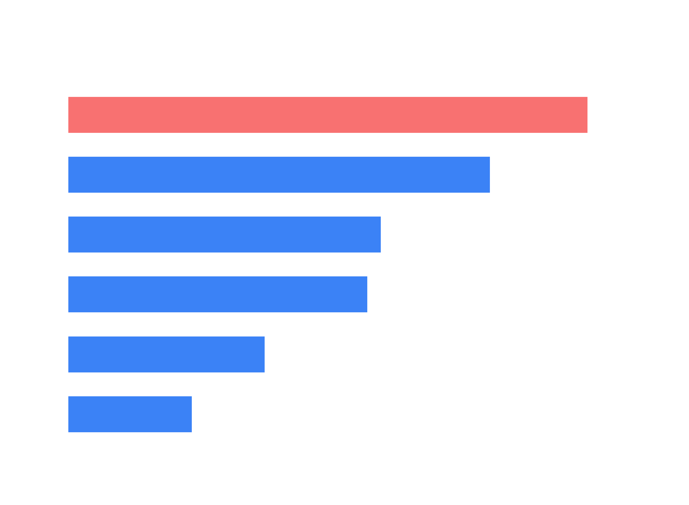
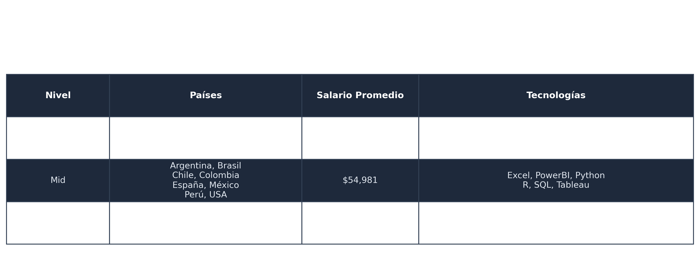

Análisis del Mercado Laboral de Analistas de Datos

1. Introducción

El crecimiento del análisis de datos ha generado una alta demanda de profesionales especializados en el manejo y análisis de información. Sin embargo, muchas personas que desean ingresar al campo no tienen claridad sobre qué habilidades técnicas son más solicitadas por las empresas.

Este proyecto analiza un dataset de 500 ofertas de empleo para analistas de datos con el objetivo de identificar las herramientas y habilidades más demandadas, nivel con mayor promedio salarial y distribucion de los puesto en base a los niveles como analista de datos en el mercado laboral.

Los resultados de este análisis pueden ayudar a estudiantes y profesionales a enfocar su aprendizaje en las habilidades que tienen mayor impacto en el mercado laboral.

2. Problema del Negocio

¿Qué herramientas de análisis de datos son las más solicitadas en las ofertas de empleo para analistas de datos?

¿Qué nivel de analista de datos tiene un mayor promedio salarial?

¿Como se distribuyen los puestos en el mercado laboral de acuerdo al nivel de un analista de datos?

3. Objetivos del Proyecto

Objetivo General

Analizar las ofertas de empleo para identificar las herramientas técnicas más demandadas en el mercado laboral, el promedio salarial de acuerdo al nivel de un analistas y la distribucion de los puestos de acuerdo al nivel del analista en el mercado laboral.

Objetivos Específicos

- Identificar las herramientas más solicitadas en las ofertas laborales.

- Analizar la relación entre herramientas y nivel del puesto.

- Identificar la distribucion de los puestos de acuerdo al nivel de un analista.

- Identificar el nivel con el mayor promedio salarial.

4. Descripción del Dataset

El dataset contiene 500 registros de ofertas de empleo para analistas de datos.

Cada registro representa una oferta laboral publicada por una empresa.

Variables del dataset
Variable	   Descripción
ID	           Identificador de la oferta
Empresa	       Empresa que publica la oferta
País	       País donde se encuentra el empleo
Nivel	       Nivel del puesto (Junior, Mid, Senior)
Salario	       Salario anual
Python	       Si la oferta requiere Python
SQL	           Si la oferta requiere SQL
Excel	       Si la oferta requiere Excel
PowerBI	       Si la oferta requiere Power BI
Tableau	       Si la oferta requiere Tableau
R	           Si la oferta requiere R

5. Herramientas Utilizadas

Este proyecto fue desarrollado con diferentes herramientas como:

- Microsoft Excel para limpieza de los datos, el analisis EDA, graficas e informe.

- Microsoft Power BI para el Análisis Exploratorio de Datos (EDA) y dashboards.

- Python para análisis avanzado y visualizaciones.

6. Resultados

¿Qué herramientas de análisis de datos son las más solicitadas en las ofertas de empleo para analistas de datos?

- SQL es la herramienta más demandada
- Excel sigue siendo fundamental
- Python crece con la experiencia.
  
¿Qué nivel de analista de datos tiene un mayor promedio salarial?

- El nivel Senior es quien tiene el mayor promedio salarial en comparacion con los niveles Mid y Junior.

¿Como se distribuyen los puestos en el mercado laboral de acuerdo al nivel de un analista de datos?

- Se distribuyen de la siguiente manera: Junior con un 47.8%, Mid con un 31.8% y Senior con un 20.4%, donde podemos
  concluir que hay una mayor demanda para el puesto de Junior.

7. Visualizaciones

8. Estructura del proyecto

- Analisis-mercado-analistas-datos: Caperta principal.

- Data: Carperta que contiene el Dataset.

- Env: Carpeta del entorno virtual de Python que contiene instalacion de python y sus librerias.

- Excel: Carpeta que contiene archivo de analisis con Excel.

- Imagenes: Carpeta que contiene las imagenes del analisis en python, el EDA y Dashboard en Power Bi.

- Powerbi: Contiene que contiene archivo de analisis con Powerbi.

- Python: Carpeta que contiene archivo de analisis con Python.

- Readme.md: Archivo informe sobre el proyecto.

- Requirements.txt: Archivo de las librerias requeridas para el proyecto.
